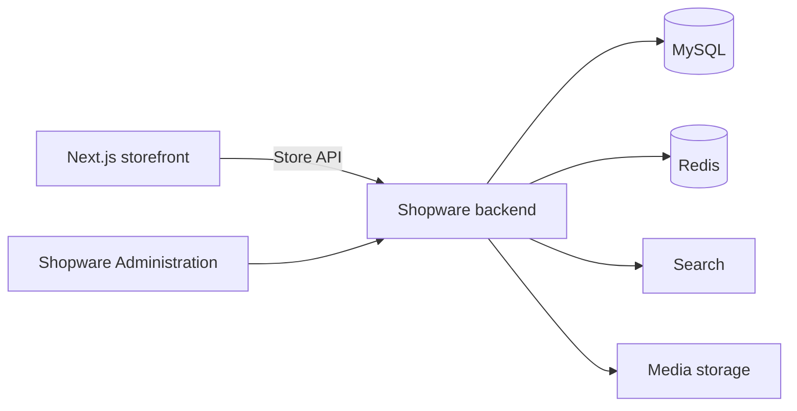
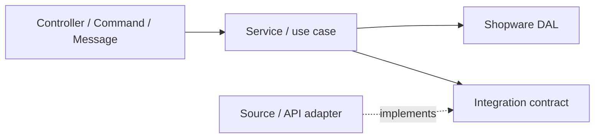

# Backend architecture

## Роль backend

Backend проекта — Shopware 6 с собственными расширениями. Отдельного прикладного API поверх Shopware нет.

Shopware отвечает за каталог, категории, свойства, цены, контент, клиентов, корзины, заказы, оплаты, доставку и настройки рынков. Публичная витрина находится в отдельном Next.js-приложении и работает с Shopware через Store API. Для функций, которых нет в стандартном Store API, добавляются собственные routes внутри соответствующего Shopware-плагина.

Администрация Shopware остаётся интерфейсом для управления магазином. Публичный HTML и SEO-разметку формирует Next.js; необходимые данные и настройки хранит backend.



Развёртывание, сеть, конкретная конфигурация сервисов и мониторинг описываются в общем репозитории `jvmoebel-shopware-docs`.

## Магазины и sales channels

Все рынки работают в одной установке Shopware. Каталог, дерево категорий и свойства товаров общие. Для каждого домена создаётся отдельный sales channel с собственными языком, валютой, доменом и доступными настройками магазина.

Sales channels имеют штатный тип Storefront, чтобы Shopware генерировала sales-channel-specific SEO URL и предоставляла их через Store API. Twig Storefront наружу не публикуется: единственным публичным frontend остаётся Next.js.

Клиент и заказ принадлежат конкретному sales channel. Авторизация покупателя между доменами не объединяется. Различия в ценах, доставке, оплате и ассортименте задаются средствами Shopware и конфигурацией соответствующего sales channel.

## Расширение Shopware

Собственный код проекта находится в `custom/static-plugins/` и подключается через корневой Composer-проект. Каталог `custom/plugins/` используется для установленных сторонних расширений и не хранится в Git. Ядро Shopware, `vendor/` и код сторонних плагинов не изменяются.

Плагин объединяет одну связанную функциональную область. Не создаём один общий плагин для всего проекта, но и не выделяем новый плагин для каждой небольшой задачи. Граница плагина определяется по ответственности, данным и внешним зависимостям функции.

Базовая структура собственного плагина соответствует Shopware:

```text
custom/static-plugins/JvFeature/
├── composer.json
├── src/
│   ├── JvFeature.php
│   ├── Resources/config/services.xml
│   └── ...
└── tests/
```

Входные точки располагаются в стандартных для Shopware каталогах:

```text
src/
├── Controller/
├── Command/
├── MessageQueue/
├── ScheduledTask/
├── Subscriber/
├── Service/
├── Integration/
├── Migration/
├── Core/Content/
└── Resources/app/administration/
```

Пустые каталоги не создаются. Структура расширяется только под фактический код плагина.

## Слои внутри плагина

Symfony считает сервисом любой объект, зарегистрированный в DI-контейнере. В архитектуре мы дополнительно различаем ответственность этих объектов.



- **Входной слой** принимает HTTP-запрос, console command, событие или сообщение и вызывает прикладной сценарий. К нему относятся `Controller/`, `Command/`, `Subscriber/`, `ScheduledTask/` и `MessageQueue/`.
- **Application-слой** находится в `Service/`. Здесь располагаются use cases и другие прикладные сервисы, которые выполняют сценарий и координируют DAL, очередь и интеграции.
- **Data access** предоставляет Shopware DAL. Use case работает с DAL repositories напрямую либо через специализированный writer/query внутри своей функциональной области. Собственные definitions и entities размещаются в `Core/Content/`.
- **Integration-слой** содержит реализации для внешних источников, API и форматов данных. Сюда относятся readers, clients, normalizers и adapters.

`Service/` делится по функциональным областям. Use cases импорта, SEO или другой области не смешиваются в одном каталоге. Класс получает название по выполняемому действию или конкретной ответственности; общий `ProductService` не заменяет набор отдельных сценариев.

Пример структуры функции импорта:

```text
src/
├── Command/
│   └── ImportProductsCommand.php
├── MessageQueue/
│   └── ImportProductsHandler.php
├── Service/
│   └── ProductImport/
│       ├── ImportProductsService.php
│       ├── ImportProductBatchService.php
│       ├── ShopwareProductWriter.php
│       ├── Contract/
│       ├── Dto/
│       ├── Exception/
│       └── Validation/
└── Integration/
    └── CosmoShop/
        ├── CosmoShopProductSource.php
        ├── Exception/
        ├── Reader/
        └── Normalizer/
```

`ImportProductsService` не вызывает CosmoShop normalizer напрямую. Он получает нормализованные `ProductImportData` через `ProductSourceInterface`. Реализация `CosmoShopProductSource` сама использует нужные reader и normalizer, поэтому детали исходного формата не попадают в application-слой.

`Service/`, `Helper/`, `Utils/` и `Manager/` не используются как место для несвязанного кода. Название класса и каталог должны показывать его функцию.

Зависимости передаются через конструктор и регистрируются в DI-контейнере Symfony. Прикладной код не получает сервисы напрямую из контейнера.

## Интерфейсы и абстракции

Интерфейс вводится, когда он задаёт настоящую границу или точку заменяемости: источник данных, внешняя интеграция или взаимодействие между плагинами.

Например, импорт товаров зависит от `ProductSourceInterface`, а CosmoShop предоставляет одну из его реализаций. CosmoShop reader и normalizer могут оставаться конкретными внутренними классами этой реализации, пока для них нет отдельной точки замены.

Интерфейс, определяющий границу application-слоя, размещается со стороны потребителя: `Service/<Feature>/Contract/`. Реализация внешней интеграции находится в `Integration/`.

Небольшой локальный interface, который не является межслойным контрактом, располагается рядом с реализацией в её функциональном namespace. Публичные интерфейсы для взаимодействия между плагинами находятся в `Contract/` соответствующей функции либо в корневом `Contract/` плагина, если относятся ко всему плагину.

Глобальный каталог со всеми интерфейсами проекта не создаётся. Интерфейсы также не добавляются автоматически для каждого класса. Общие абстракции, `Shared` или универсальные helpers появляются только после реального повторного использования и с понятной ответственностью.

## Объекты данных и бизнес-правила

DTO содержит типизированные данные без бизнес-поведения и размещается в `Service/<Feature>/Dto/`. Например, `ProductImportData` представляет нормализованный товар, который источник передаёт сценарию импорта.

Value object содержит значение и связанные с ним правила. Каталог `ValueObject/` создаётся внутри функции только при появлении таких объектов. Результат операции может быть отдельным классом рядом с use case либо в `Dto/`, если это обычный объект передачи данных.

DAL entities Shopware считаются моделями хранения. Нельзя полагаться на метод entity для обязательного инварианта: запись через `repository->create()`, `update()` или `upsert()` принимает массив данных и может обойти этот метод.

Прикладное правило проверяется в use case до записи. Инвариант, который должен соблюдаться при любом способе изменения данных, дополнительно защищается DAL validation event или ограничением базы. Для конкурентных изменений используются транзакция и атомарная операция.

Отдельная доменная модель с поведением вводится, когда появляется действительно сложная логика, которую нельзя надёжно выразить application-сценарием, DAL и ограничениями базы.

## Данные и фоновые задачи

Для сущностей Shopware используется DAL. Прямой SQL допустим в миграциях схемы и обоснованных пакетных операциях, где DAL не подходит; он не должен обходить обязательные правила и индексаторы Shopware.

Долгие операции выполняются вне HTTP-запроса через Messenger или scheduled tasks. Основная очередь проекта работает через Redis. Обработчик должен корректно переносить повторный запуск и не создавать дубли при повторной доставке сообщения.

Изменение схемы базы выполняется миграциями плагина. Перенос или массовое исправление данных оформляется отдельной командой либо импортным процессом, а не маскируется под миграцию схемы.

## Связи между плагинами

Плагин владеет своими сущностями, миграциями, настройками и сообщениями. Другой проектный плагин не обращается напрямую к его таблицам и внутренним классам.

Для взаимодействия используются явно предоставленный интерфейс, событие или сообщение. Зависимость объявляется в Composer и направляется в одну сторону. Циклические зависимости между плагинами не допускаются.

Если меняется Store API, формат сообщения, общая модель данных или поведение, от которого зависит другой репозиторий, изменение сначала фиксируется в specification. Архитектурные решения, влияющие на всю платформу, фиксируются ADR в общем репозитории документации.
