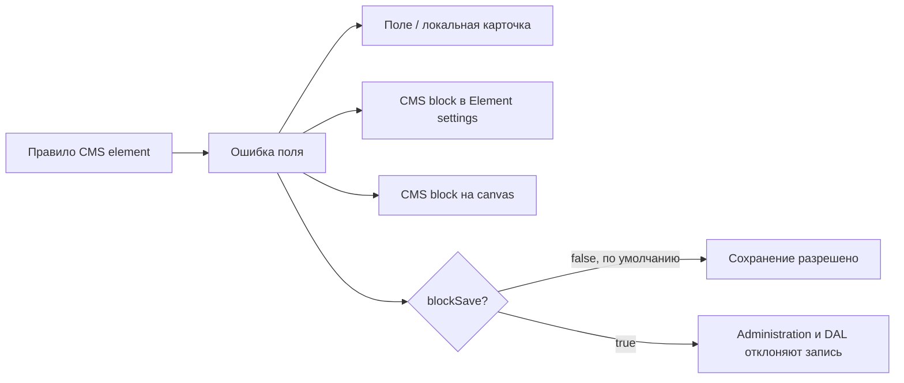

# SPEC-021 — Общая валидация CMS elements

## Цель

Предоставить плагину `JvCms` единый способ показывать ошибки конфигурации Shopping Experiences element и, когда это явно требуется правилом, запрещать сохранение CMS-страницы в Administration и на сервере.

Документ одновременно задаёт контракт механизма и инструкцию подключения нового CMS element. Он является каноническим источником для разработчиков и AI-агентов: специфичная specification элемента описывает, **что** проверяется, а этот документ — **как** правило подключается и отображается.

## Границы

Входит:

- локализованная ошибка конкретного поля в Element settings;
- выделение вложенной группы/карточки элемента, содержащей ошибку;
- выделение карточки CMS block в Element settings;
- выделение CMS block на canvas через штатное состояние Shopware;
- opt-in блокировка сохранения страницы в Administration;
- серверная защита opt-in правил при записи перевода `cms_slot` через DAL;
- точки расширения для правил отдельных CMS elements;
- существующие правила `jv-faq` и `jv-home-editorial`.

Не входит:

- автоматическая проверка схемы или контракта всего CMS config;
- вывод ошибок Store API resolver или frontend parser в Administration;
- изменение Store API payload;
- перевод серверного текста ошибки по locale пользователя;
- универсальный DSL или генерация PHP-правил из JavaScript;
- изменение Shopware core или `vendor/`.

Malformed persisted config считается недоверенным input. Пока проверка контракта не входит в механизм, правило не создаёт отдельную ошибку типа/схемы и не должно выбрасывать ошибку доступа к полю. Неизвестный корневой контейнер правила обычно даёт пустой список; отсутствующее значение внутри уже распознанной записи может считаться нарушением конкретного бизнес-правила, если это зафиксировано в specification элемента.

## Сценарий

1. Administration загружает общий `jvCmsValidationService`, mixin, SCSS и интеграционные overrides до регистрации CMS elements.
2. `validation.js` рядом с element регистрирует одно или несколько правил для его `element.type`.
3. Правило читает реактивный `element.config` и возвращает список ошибок.
4. Config component получает ошибки через mixin и привязывает их к полям или локальным блокам.
5. Общие overrides агрегируют ошибки slot → CMS block → CMS page и выделяют соответствующие контейнеры.
6. Если хотя бы одна клиентская ошибка содержит `blockSave: true`, Administration отклоняет обычный и прямой сценарии сохранения и показывает штатное сообщение Shopware о невалидной странице.
7. При DAL-записи сервер повторно вычисляет зарегистрированные PHP-правила. Только ошибка с `blockSave: true` становится `WriteConstraintViolationException`.



## Данные

### Ошибка Administration

Каждая функция-правило возвращает array объектов следующего вида:

| Поле | Обязательность | Значение |
|---|---|---|
| `code` | рекомендуется | Стабильный уникальный код, например `JV_CMS_FAQ_QUESTION_REQUIRED`; при отсутствии используется `JV_CMS_VALIDATION_ERROR` |
| `fieldPath` | да | Dot path, который config template передаст в `cmsValidationFieldError()`, например `items.0.question` |
| `blockPath` | нет | Dot path локальной группы/карточки, например `items.0`; `null`, если локальная группа не нужна |
| `message` | да | Ключ Administration snippet, а не готовый текст |
| `parameters` | нет | Параметры для `$t`; по умолчанию `{}` |
| `presentation` | нет | `field` по умолчанию либо `block` для сообщения, которому не соответствует существующее поле |
| `blockSave` | нет | Только literal `true` запрещает сохранение; по умолчанию `false` |

`fieldPath` и `blockPath` являются внутренними идентификаторами UI. Они должны детерминированно строиться из текущих индексов/ключей config и точно совпадать со строками в template.

### Ошибка сервера

`CmsElementValidationError` содержит:

- `fieldPath` — путь внутри DAL payload, начинающийся с `/config`, например `/config/items/value/0/question`;
- `message` — безопасный текст API-ошибки;
- `code` — тот же семантический код, что у Administration-правила;
- `blockSave` — `false` по умолчанию.

UI dot path и серверный DAL path имеют разный синтаксис, но должны указывать на одно и то же логическое поле. Клиентское и PHP-правила не синхронизируются автоматически.

## Правила

- Регистрация отсутствующего element type означает отсутствие ошибок и не влияет на сохранение.
- Несколько зарегистрированных правил одного element type выполняются в порядке регистрации; их ошибки объединяются.
- Функция-правило возвращает array. Любой другой результат трактуется как отсутствие ошибок.
- Наличие любой ошибки выделяет CMS block в Element settings и на canvas независимо от `blockSave`.
- `presentation: field` используется, когда в template существует компонент с prop `error`.
- `presentation: block` используется только когда конкретного поля нет, например список обязательных paragraphs пуст и editor ещё не создан.
- Локальный текст Administration всегда хранится в snippets минимум для `de-DE` и `en-GB`.
- `blockSave` не выводится из severity, `presentation` или наличия ошибки. Блокировка включается только literal `true` и должна быть явно зафиксирована в specification соответствующего CMS element.
- Для блокирующего бизнес-правила обязательны одинаковая семантика и одинаковый `blockSave: true` в JavaScript и PHP. Клиентская проверка нужна для UX, серверная — для защиты всех DAL entry points.
- Неблокирующее правило может иметь PHP-реализацию для единого набора кодов и будущего включения защиты; `CmsSlotWriteValidator` не создаёт violation, пока `blockSave` равен `false`.
- Серверный subscriber не валидирует форму неизвестного config и не превращает malformed JSON/array в ошибку контракта в рамках этой версии. Специфичное правило может нормализовать отсутствующее дочернее значение только для проверки своего явно описанного условия.
- Ошибка исчезает реактивно после исправления config; отдельное локальное состояние ошибок в component не хранится.
- Специфичная логика и стили не добавляются в общий service или integration override.

### Текущее поведение элементов

| Element | Правило | Представление | Блокирует сохранение |
|---|---|---|---|
| `jv-faq` | Каждый существующий item должен иметь непустые string `question` и `answer` | Ошибка каждого конкретного поля + выделение item | Нет |
| `jv-home-editorial` | Каждая существующая section должна иметь хотя бы один непустой string paragraph | Ошибки существующих пустых editors; при отсутствии editors — сообщение секции | Нет |
| `jv-social-block` | Список social items не должен быть пустым; каждый существующий item должен иметь непустую string ссылку | Сообщение списка либо ошибка URL + выделение item | Нет |

Проверки root-полей и полная проверка контрактов этих elements в текущий этап не входят.

## Размещение кода

```text
custom/static-plugins/JvCms/src/
├── Resources/app/administration/src/
│   ├── service/cms-validation/          # общий service и mixin
│   ├── extension/                       # overrides интеграции с Shopware
│   ├── scss/cms-validation.scss         # только общие стили контейнеров
│   └── module/sw-cms/elements/<type>/
│       ├── validation.js                # правила конкретного element
│       └── config/                      # bindings и специфичный SCSS
└── Service/Validation/                  # серверный validator, subscriber и правила
```

Общие imports находятся в `Resources/app/administration/src/main.js` перед imports отдельных elements. Integration overrides расширяют `sw-cms-detail`, `sw-cms-section` и `sw-cms-page-form`; element-specific код не добавляет новые overrides этих компонентов.

Серверные реализации `CmsElementValidationRuleInterface` регистрируются в `Resources/config/services.xml` с tag `jv.cms.element_validation_rule`. `CmsElementValidator` группирует их по `elementType()`, а `CmsSlotWriteValidator` применяет их к config переводов `cms_slot` во время `PreWriteValidationEvent`.

## Инструкция подключения CMS element

Шаги выполняются в указанном порядке. Перед добавлением правила в specification элемента фиксируются условие ошибки, целевое поле, текст, код и решение о блокировке сохранения.

### 1. Объявить Administration-правило рядом с element

Создать `module/sw-cms/elements/<type>/validation.js`. Правило должно быть чистой функцией, не изменять `element` и безопасно обрабатывать отсутствующую или неожиданную структуру.

```js
export default [
    (element) => {
        const title = element?.config?.title?.value;
        if (typeof title !== 'string') {
            return [];
        }

        if (title.trim()) {
            return [];
        }

        return [{
            code: 'JV_CMS_EXAMPLE_TITLE_REQUIRED',
            fieldPath: 'title',
            message: 'cms.elements.jv-example.config.title.required',
        }];
    },
];
```

Этот пример намеренно не считает отсутствующий/non-string config нарушением: такая проверка была бы проверкой контракта. Если элемент имеет repeater, правило дополнительно возвращает `blockPath`, например `items.${itemIndex}`.

### 2. Зарегистрировать правило при регистрации element

В `module/sw-cms/elements/<type>/index.js`:

```js
import validationRules from './validation';

// Обычная регистрация component и cmsService остаётся здесь.
Shopware.Service('jvCmsValidationService').register('jv-example', validationRules);
```

Строка `jv-example` должна точно совпадать с `type` в `registerCmsElement()` и `element.type`.

Общий service уже импортируется в `main.js`. Не импортировать и не регистрировать его повторно внутри отдельного element.

### 3. Подключить mixin к config component

```js
const { Mixin } = Shopware;

export default {
    mixins: [
        Mixin.getByName('cms-element'),
        Mixin.getByName('jv-cms-validation'),
    ],
};
```

Mixin предоставляет:

- `cmsValidationFieldError(fieldPath)` — Shopware-compatible error либо `null`;
- `cmsValidationBlockClass(blockPath)` — объект класса локального invalid block;
- `cmsValidationBlockError(blockPath)` — ошибка с `presentation: block` либо `null`;
- `cmsValidationErrors` — нормализованный список всех ошибок текущего element.

### 4. Привязать ошибку к точному полю

Для Meteor/Shopware form component с prop `error`:

```twig
<mt-text-field
    v-model:model-value="element.config.title.value"
    :error="cmsValidationFieldError('title')"
/>
```

Для поля внутри repeater path строится тем же способом, что в правиле:

```twig
:error="cmsValidationFieldError(`items.${itemIndex}.question`)"
```

Не заменять field error общей banner, если конкретный input/editor существует.

### 5. Привязать локальный block и специфичный стиль

```twig
<div
    class="sw-cms-el-config-jv-example__card"
    :class="cmsValidationBlockClass(`items.${itemIndex}`)"
>
```

В SCSS этого element, а не в общем `scss/cms-validation.scss`:

```scss
.sw-cms-el-config-jv-example {
    &__card.jv-cms-validation-block--invalid {
        border-color: var(--color-border-critical-default);
    }
}
```

Если целевого field component ещё нет, правило получает `presentation: 'block'`, а template выводит локализованный detail:

```twig
<mt-banner
    v-if="cmsValidationBlockError('items')"
    variant="critical"
>
    {{ cmsValidationBlockError('items').detail }}
</mt-banner>
```

### 6. Добавить локализованные snippets

Одинаковый ключ `message` добавляется минимум в:

```text
Resources/app/administration/src/snippet/de-DE.json
Resources/app/administration/src/snippet/en-GB.json
```

Текст должен объяснять конкретное исправление, например «Введите вопрос», а не только сообщать «Некорректное значение».

### 7. При необходимости явно включить блокировку

Для неблокирующего правила ничего добавлять не нужно. Чтобы запретить сохранение, Administration-ошибка получает:

```js
blockSave: true,
```

Такое изменение нельзя делать только на клиенте. Нужно выполнить следующий серверный шаг и обновить specification элемента.

### 8. Добавить серверное правило для блокировки DAL-записи

Создать класс в `JvCms/src/Service/Validation`, реализующий `CmsElementValidationRuleInterface`, и вернуть ошибку с тем же семантическим code:

```php
final class ExampleCmsElementValidationRule implements CmsElementValidationRuleInterface
{
    public function elementType(): string
    {
        return 'jv-example';
    }

    public function validate(array $config): array
    {
        // Безопасно прочитать только данные, необходимые конкретному правилу.

        return [new CmsElementValidationError(
            fieldPath: '/config/title/value',
            message: 'Enter a title.',
            code: 'JV_CMS_EXAMPLE_TITLE_REQUIRED',
            blockSave: true,
        )];
    }
}
```

Зарегистрировать класс:

```xml
<service id="Jv\Cms\Service\Validation\ExampleCmsElementValidationRule">
    <tag name="jv.cms.element_validation_rule"/>
</service>
```

PHP-правило не должно полагаться на то, что Administration уже выполнила проверку. Оно получает persisted config в Shopware-формате `{ source, value }`.

### 9. Добавить проверки и собрать Administration

Минимальная автоматическая проверка серверного правила покрывает:

- маршрутизацию по точному element type;
- валидный config без ошибок;
- каждую значимую ошибку и точный `fieldPath`;
- `blockSave` для блокирующего и неблокирующего сценариев;
- malformed config без неожиданного exception.

Для нового блокирующего правила дополнительно требуется integration-тест `CmsSlotWriteValidator`: запись должна отклоняться через DAL, а неблокирующая ошибка — сохраняться.

После изменения Administration source:

```bash
docker compose exec web bash bin/build-administration.sh
```

Production assets из `Resources/public/administration` входят в изменение. Полный набор обязательных команд выполняется по `docs/WORKFLOW.md`.

### Контрольный список для разработчика или AI-агента

- [ ] Условие ошибки и решение о `blockSave` записаны в specification конкретного element.
- [ ] `validation.js` находится рядом с element и не изменяет входной `element`.
- [ ] Правило зарегистрировано для точного `element.type`.
- [ ] Config component использует mixin `jv-cms-validation`.
- [ ] Каждый существующий field component получает свой точный `fieldPath`; `presentation: block` не подменяет доступную field error.
- [ ] Локальная группа использует `blockPath` и специфичный SCSS рядом с element.
- [ ] Ключ сообщения существует в `de-DE.json` и `en-GB.json`.
- [ ] `blockSave` отсутствует для информационной ошибки либо явно равен `true` для согласованного блокирующего правила.
- [ ] Для `blockSave: true` добавлены PHP-правило, DI tag и integration-тест DAL-записи.
- [ ] Не добавлена неоговорённая contract validation и не изменены общие overrides ради одного element.
- [ ] Обновлены unit-тесты, Administration assets и ручной сценарий проверки.

## Ошибки и повтор

| Случай | Ожидание |
|---|---|
| Для element type нет правил | Ошибок нет, сохранение разрешено |
| Правило вернуло не array | Результат игнорируется |
| `blockSave` отсутствует или не равен literal `true` | Сохранение разрешено |
| Есть неблокирующая ошибка | Все уровни UI выделены, сохранение разрешено |
| Есть блокирующая ошибка | Все уровни UI выделены; Administration отклоняет save; DAL возвращает constraint violation |
| Config исправлен | Ошибка и подсветка исчезают без отдельного reset |
| Корневой контейнер правила имеет неизвестную структуру | Правило безопасно пропускает его; автоматическая contract validation не выполняется |
| Прямой save после Shopware modal | `onSaveEntity()` повторно проверяет блокирующие ошибки |
| Повторная DAL-запись невалидного config | Сервер снова отклоняет её тем же code и path |

Ожидаемая validation error не логируется как системная ошибка и не содержит stack trace, SQL, внутренних файловых путей или пользовательских данных сверх необходимого значения поля.

## Изменения Shopware

### Administration

- `service/cms-validation` регистрирует `jvCmsValidationService` и mixin `jv-cms-validation`;
- `extension/sw-cms-detail` объединяет штатную проверку страницы с opt-in save blocking;
- `extension/sw-cms-section` передаёт наличие ошибок в штатный `sw-cms-block` canvas;
- `extension/sw-cms-page-form` добавляет invalid class карточке block в Element settings;
- `scss/cms-validation.scss` содержит общую рамку Element settings;
- правила и специфичные стили FAQ/Home Editorial остаются рядом с elements.

### PHP

- `CmsElementValidationRuleInterface` задаёт точку расширения;
- `CmsElementValidator` маршрутизирует tagged rules по element type;
- `CmsElementValidationError` переносит path, message, code и флаг блокировки;
- `CmsSlotWriteValidator` является DAL entry point и создаёт violations только для `blockSave: true`;
- `FaqCmsElementValidationRule`, `HomeEditorialCmsElementValidationRule` и `SocialBlockCmsElementValidationRule` переносят специфичные неблокирующие проверки.

`CmsSlotWriteValidator` получает type slot из команд текущей write operation. Для update, где type не входит в payload, используется параметризованный read-only SQL к `cms_slot`: в `PreWriteValidationEvent` связанная запись может ещё не быть доступна через результат текущей DAL-записи, а validator должен определить правило до выполнения write commands. SQL не читает CMS config и не изменяет данные.

Новых entities, migrations, Store API routes и изменений публичного CMS `data` нет.

## Проверка

Автоматические тесты общего механизма покрывают маршрутизацию зарегистрированных PHP-правил, точные пути FAQ/Home Editorial, валидные значения и неблокирующее значение по умолчанию.

Ручная приёмка для каждого подключённого element:

- ошибка появляется у конкретного поля с текстом текущей Administration locale;
- локальная карточка/repeater item выделяется, если правило задаёт `blockPath`;
- содержащий element CMS block выделяется в Element settings и на canvas;
- после исправления значения все связанные состояния исчезают;
- неблокирующее правило позволяет сохранить страницу;
- блокирующее правило не позволяет сохранить страницу обычным и прямым Shopware save path;
- после reload сохранённые валидные данные не получают ложную ошибку.

Синтаксис JavaScript, Twig, JSON и SCSS проверяется до полной сборки. Перед merge выполняются `lint`, `analyse`, `test`, Administration build и ручной сценарий согласно `docs/WORKFLOW.md`.
